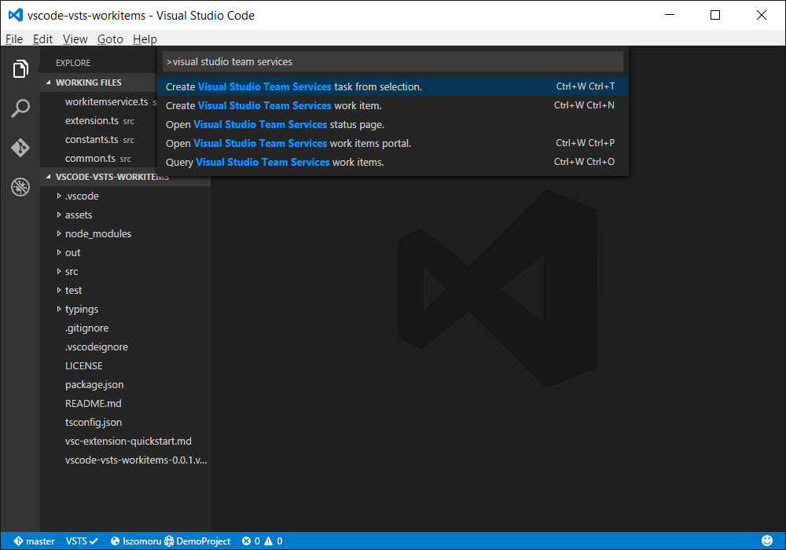
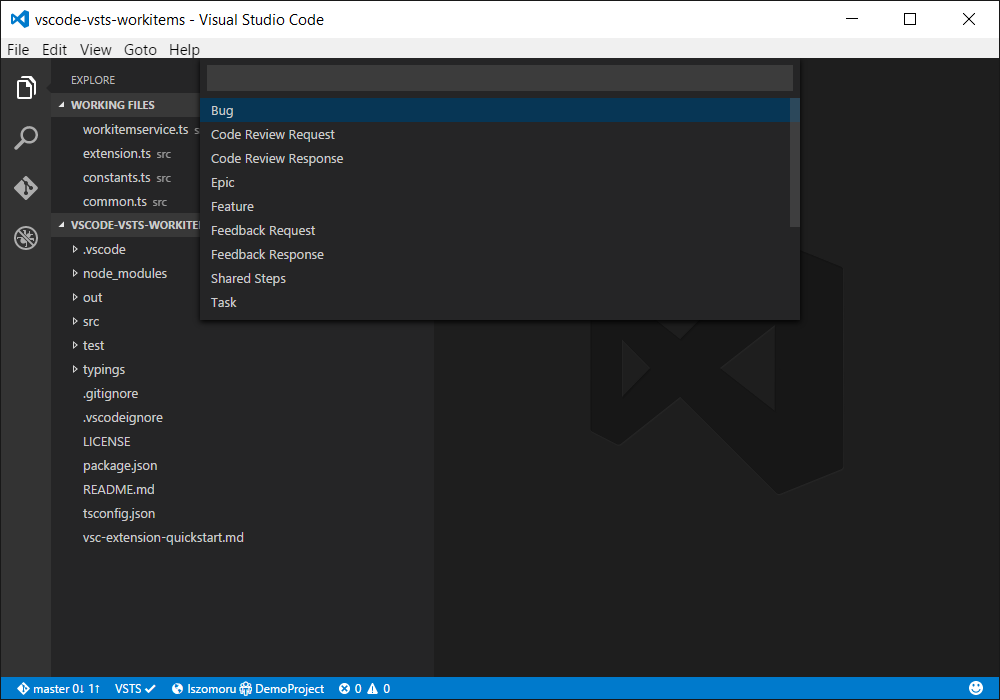
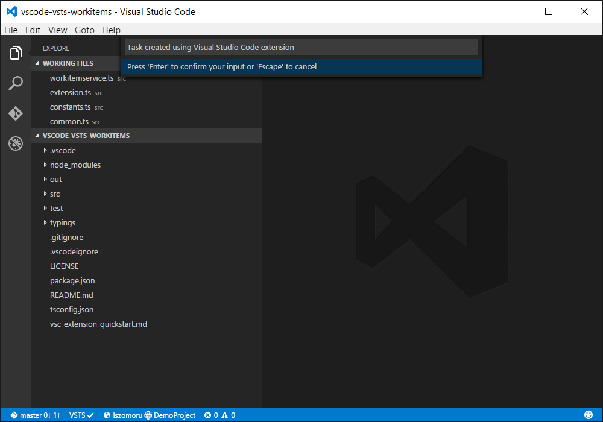
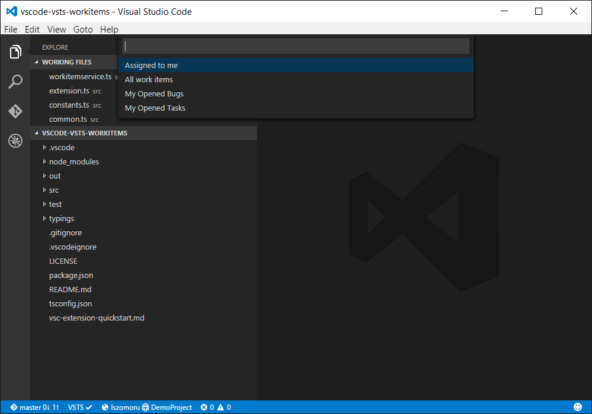
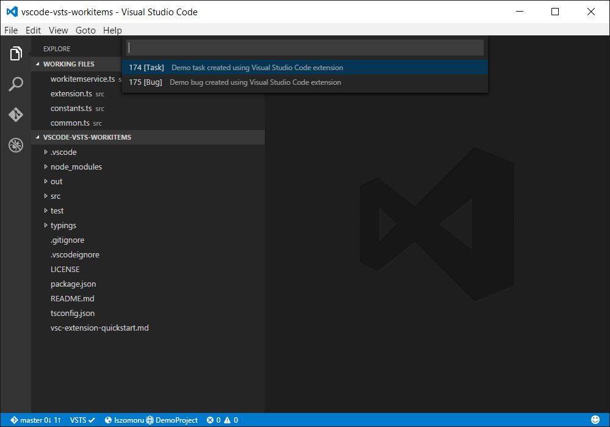

# Visual Studio Team Services work items extension

Create, query, and access Visual Studio Team Services work items from within Visual Studio Code.

## Features
The features are available through the three commands that were added to the [command palette](https://code.visualstudio.com/Docs/editor/codebasics#_command-palette): *Open Visual Studio Team Services work items portal*, *Create Visual Studio Team Services work item*, and *Query Visual Studio Team Services work items*.
### Visual Studio Team Services account/team project indicator
Based on the information specified in ```settings.json``` a visual indicator is added to the Visual Studio Code status bar with the details of the Visual Studio Team Service account and team project that the extension is connected to.

### Create new work item


### Query work items
Execute a work item querie stored in the "My Queries" folder and open a work item that is returned by the work item query.



## Configuration 
In order for the extension to access your Visual Studio Team Servies account you need to provide the account name, the team project name, and a [personal access token](https://www.visualstudio.com/en-us/news/2015-jul-7-vso.aspx) with "work items (read and write)" permission. After installing the extension, open your settings.json (type *Preferences: Open user settings* in the [command palette](https://code.visualstudio.com/Docs/editor/codebasics#_command-palette)) and add the following section and restart Visual Studio Code:
```
{
	// Visual Studio Team Services account (Ex: contoso.visualstudio.com).
	"vsts.account": "",

	// Visual Studio Team Services personal access token.
	"vsts.pat": "",

	// Visual Studio Team Services team project name.
	"vsts.teamProject": ""
}
```

## License
MIT. For more details check [LICENSE](LICENSE).
